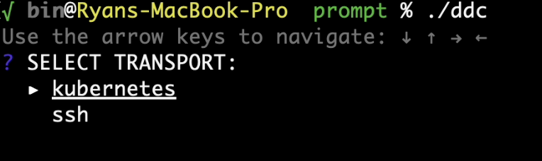
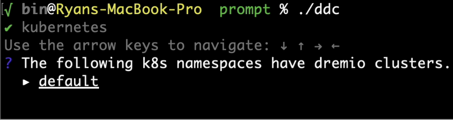
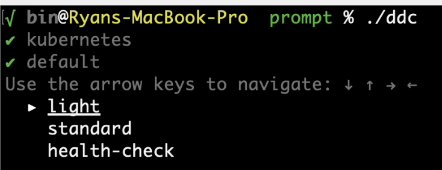
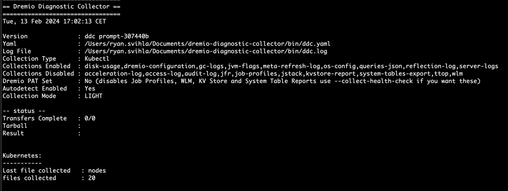

[](https://goreportcard.com/report/github.com/dremio/dremio-diagnostic-collector)


Automated log and analytics collection for Dremio clusters

## IMPORTANT LINKS

* Read the [FAQ](FAQ.md) for common questions on setting up DDC
* Read the [ddc.yaml](default-ddc.yaml) for a full, detailed list of customizable collection parameters (optional)
* Read the [official Dremio Support page](https://support.dremio.com/hc/en-us/articles/15560006579739) for more details on the DDC architecture

### Install DDC on your local machine

Download the [latest release binary](https://github.com/dremio/dremio-diagnostic-collector/releases/latest):

1. Unzip the binary
2. Open a terminal and change to the directory where you unzipped your binary
3. Run the command `./ddc help`. If you see the DDC command help, you are good to go.

### Guided Collection

```bash
ddc
```
#### select transport

#### select namespace for k8s

#### select collection type

#### enjoy progress



### Scripting - Dremio on Kubernetes

DDC connects via SSH or `kubectl` and collects a series of logs and files for Dremio, then puts those collected files in an archive

For Kubernetes deployments _(Requires `kubectl` cluster access to be configured)_:

##### default collection
```bash
ddc --namespace mynamespace
```
      
##### to collect job profiles, system tables, kv reports and wlm (via REST API)
_Requires Dremio admin privileges. Dremio PATs can be enabled by the support key `auth.personal-access-tokens.enabled`_
```bash
ddc  -n mynamespace  --collect health-check
```

### Scripting - Dremio on-prem

Specific executors that you want to collect from with the `-e` flag and coordinators with the `-c` flag. Specify SSH user, and SSH key to use.


For SSH based communication to VMs or Bare Metal hardware:

##### coordinator only

```bash
ddc --coordinator 10.0.0.19 --ssh-user myuser 
```    
##### coordinator and executors
        
```bash
ddc --coordinator 10.0.0.19 --executors 10.0.0.20,10.0.0.21,10.0.0.22 --ssh-user myuser
```

##### to collect job profiles, system tables, kv reports and wlm (via REST API)
_Requires Dremio admin privileges. Dremio PATs can be enabled by the support key `auth.personal-access-tokens.enabled`_
```bash
ddc --coordinator 10.0.0.19 --executors 10.0.0.20,10.0.0.21,10.0.0.22 --sudo-user dremio --ssh-user myuser --collect health-check
```    
    
##### to avoid using the /tmp folder on nodes

```bash
ddc --coordinator 10.0.0.19 --executors 10.0.0.20,10.0.0.21,10.0.0.22 --sudo-user dremio --ssh-user myuser --transfer-dir /mnt/lots_of_storage/
```

### Dremio AWSE

Log-only collection from a Dremio AWSE coordinator is possible via the following command. This will produce a tarball with logs from all nodes.

```bash
./ddc awselogs
```

### Dremio Cloud
To collect job profiles, system tables, and wlm via REST API, specify the following parameters in `ddc.yaml`
```yaml
is-dremio-cloud: true
dremio-endpoint: "[eu.]dremio.cloud"    # Specify whether EU Dremio Cloud or not
dremio-cloud-project-id: "<PROJECT_ID>"
dremio-pat-token: "<DREMIO_PAT>"
tmp-output-dir: /full/path/to/dir       # Specify local target directory
```
and run `./ddc local-collect` from your local machine

### Windows Users

If you are running DDC from Windows, always run in a shell from the `C:` drive prompt. 
This is because of a limitation of kubectl ( see https://github.com/kubernetes/kubernetes/issues/77310 )

### ddc.yaml

The `ddc.yaml` file is located next to your DDC binary and can be edited to fit your environment. The [default-ddc.yaml](default-ddc.yaml) documents the full list of available parameters.

